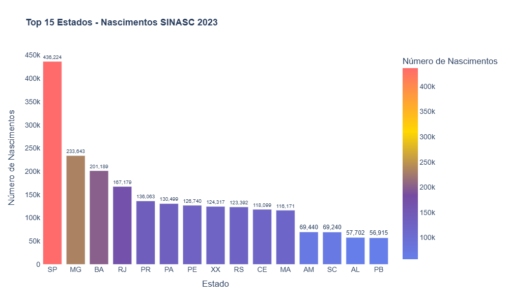
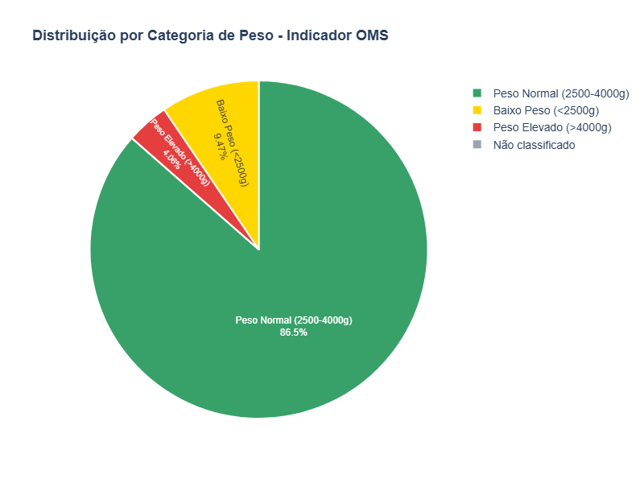
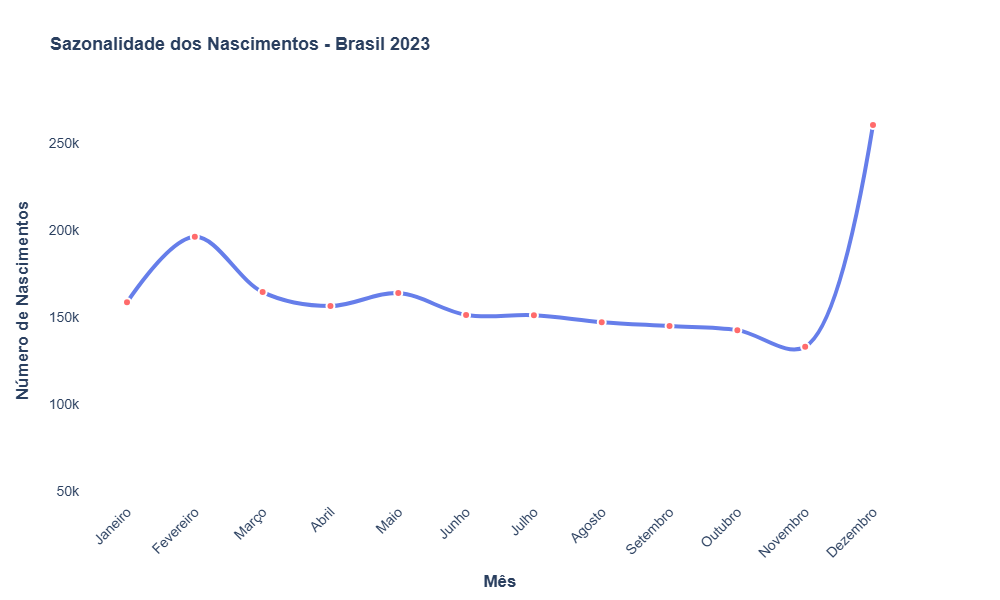
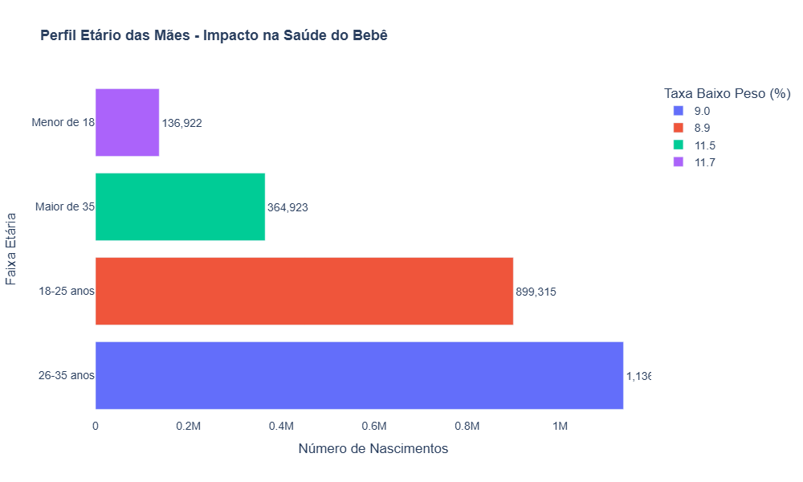
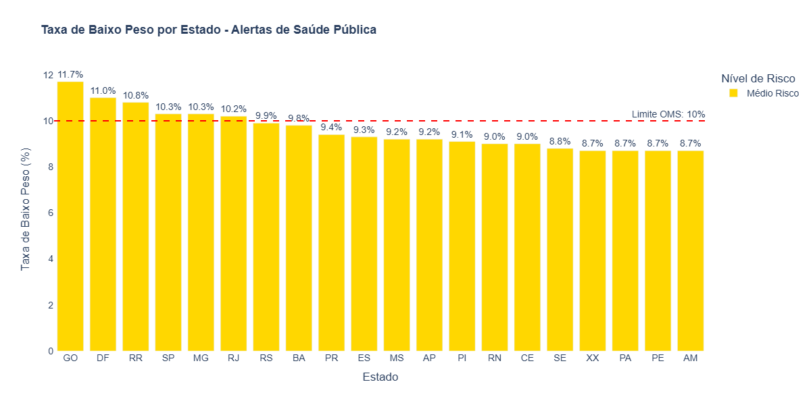
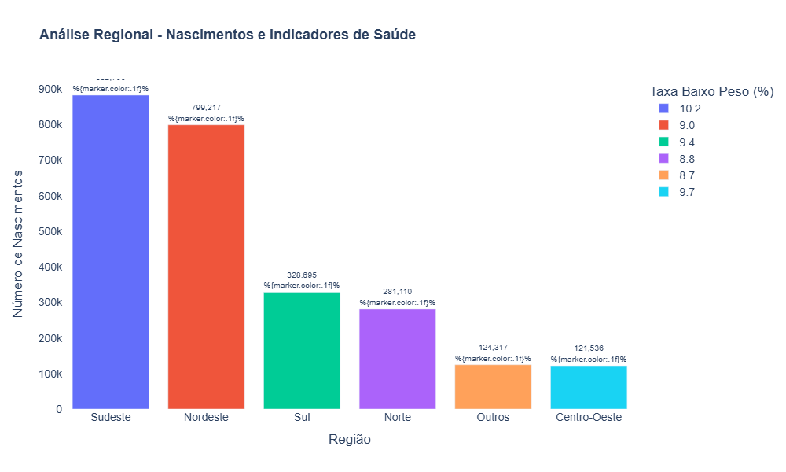

# 🏥 Health Insights Brasil  
**Autor:** Elias Gomes  
**Projeto Final - Bootcamp 2025 - Engenharia de Dados e DataOps - Triggo.ai**  

---

## 🌐 Acesse o Dashboard Interativo  
Quer explorar os dados de forma dinâmica e interativa?  
Clique aqui e acesse a versão **completa online**, com filtros, navegação e muito mais:  

🔗 **[Health Insights Brasil - Dashboard Online](https://projetofinal-bootcamp-2025-engenharia-de-dados-e-dataops-dfw74.streamlit.app/)**

> 💡 Lá você pode interagir com gráficos, pesquisar por estados, filtrar períodos e explorar diversas análises adicionais que vão além do que está documentado aqui no repositório.

---

## 📌 Sobre o Projeto
Este projeto analisa os dados do **SINASC 2023 (Sistema de Informações sobre Nascidos Vivos)**, utilizando Snowflake, dbt Cloud, Streamlit e Python.  
O objetivo é transformar dados brutos de nascimentos no Brasil em **insights visuais e interativos** para apoiar decisões em saúde pública.

---

## 📊 Principais Tecnologias Utilizadas
- **Snowflake** (armazenamento e processamento de dados)
- **dbt Cloud** (transformações e modelagem de dados)
- **Streamlit** (dashboard interativo)
- **Plotly** (visualizações gráficas)
- **Python** (integração e análise)

---

## 📈 Visualizações Geradas

### 1️⃣ Top 15 Estados por Nascimentos
Distribuição geográfica dos nascimentos. SP lidera com 436k nascimentos (17,2% do país), seguido por MG (233k) e BA (201k).  


---

### 2️⃣ Distribuição por Categoria de Peso
Indicador-chave da OMS para saúde perinatal. Brasil apresenta 9,5% de baixo peso (dentro do limite OMS de 10%), com 86,5% dos bebês nascendo com peso normal.  


---

### 3️⃣ Sazonalidade dos Nascimentos
Padrão sazonal identificado: picos em março (225k) e setembro (221k), sugerindo concepções em junho e dezembro.  


---

### 4️⃣ Perfil Etário das Mães
Mães de 26-35 anos representam 48,7% dos nascimentos com menor taxa de baixo peso (8,1%). Adolescentes (<18 anos) apresentam maior risco com 15,3% de baixo peso.  


---

### 5️⃣ Mapa de Risco - Taxa de Baixo Peso por Estado
Estados com taxa >10% (limite OMS) requerem atenção especial. Classificação automática em Alto/Médio/Baixo risco.  


---

### 6️⃣ Dashboard Executivo - KPIs Principais
Métricas executivas: 2,5M+ nascimentos processados, taxa nacional de baixo peso de 9,5% (dentro do padrão OMS), peso médio de 3.151g e cobertura de 28 estados.  


---

### 7️⃣ Análise Regional do Brasil
Comparação entre as 5 regiões brasileiras. Sudeste lidera em volume (47% dos nascimentos), Norte apresenta maior taxa de baixo peso, Sul tem melhores indicadores de saúde.  


---

## 🚀 Como Executar o Projeto Localmente

1. **Clonar este repositório:**
   ```bash
   git clone https://github.com/eliasgdeveloper/PROJETO_FINAL-BOOTCAMP-2025-ENGENHARIA-DE-DADOS-E-DATAOPS.git
   cd PROJETO_FINAL-BOOTCAMP-2025-ENGENHARIA-DE-DADOS-E-DATAOPS
