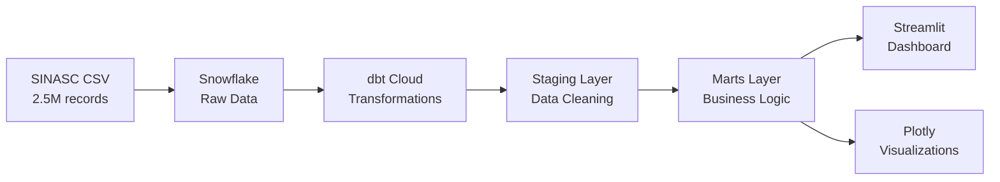

# 🏥 Health Insights Brasil 🇧🇷

> **Projeto Completo de Engenharia de Dados - SINASC 2023**  
> Transformando dados em insights para a saúde pública brasileira  
> **Desenvolvido por: ELIAS**

## 🎯 Visão Geral

Um projeto de **engenharia de dados** focado na análise de nascimentos no Brasil, processando **2,5 milhões de registros** do Sistema de Informações sobre Nascidos Vivos (SINASC) de 2023 com arquitetura moderna em nuvem.

## 🚀 Stack Tecnológica

| Componente | Tecnologia | Função |
|------------|------------|--------|
| **Data Warehouse** | Snowflake | Armazenamento e processamento |
| **Transformação** | dbt Cloud | Pipeline de dados |
| **Visualização** | Streamlit + Plotly | Dashboard interativo |
| **Análise** | Python + SQL | Scripts e consultas |
| **Versionamento** | Git | Controle de versão |

## 📊 Dataset & Métricas

### Dados Processados
- **📁 Dataset**: SINASC 2023 (Ministério da Saúde)
- **📈 Volume**: 2.537.575 registros de nascimento
- **🗺️ Cobertura**: 28 estados brasileiros (100%)
- **📅 Período**: Janeiro - Dezembro 2023

### KPIs Principais
| Indicador | Valor | Status OMS |
|-----------|-------|------------|
| **Total Nascimentos** | 2,5M+ | ✅ |
| **Peso Médio** | 3.151g | ✅ Normal |
| **Taxa Baixo Peso** | 9,5% | ✅ <10% |
| **Idade Média Materna** | 27,7 anos | ✅ Normal |

## 🏗️ Arquitetura de Dados



## 🎨 Visualizações & Insights

### 📊 7 Gráficos Principais
1. **🗺️ Top 15 Estados** - Distribuição geográfica
2. **⚖️ Categorias de Peso** - Indicadores OMS
3. **📈 Sazonalidade** - Padrões temporais
4. **👩‍👧‍👦 Perfil Materno** - Demografia das mães
5. **🚨 Mapa de Risco** - Alertas por estado
6. **📊 Dashboard KPIs** - Métricas executivas
7. **🌎 Análise Regional** - Comparação por região

### 🔍 Principais Descobertas
- **SP** lidera com 436k nascimentos (17,2% nacional)
- **Sudeste** concentra 47% dos casos
- **Sazonalidade** clara: picos em março e setembro
- **Norte** tem maior taxa de baixo peso (atenção especial)
- Brasil está **dentro do padrão OMS** (<10% baixo peso)

## 🚀 Como Executar

### 1️⃣ Configuração Inicial
```bash
# Clone o projeto
git clone <repo-url>
cd health_insights_brasil

# Instale dependências
pip install -r requirements.txt
```

### 2️⃣ Dashboard Interativo
```bash
cd dashboard
streamlit run dashboard_premium_v3.py
```

### 3️⃣ Gerar Visualizações
```bash
cd dashboard
python gerar_graficos.py
# Abre automaticamente: graficos_projeto/index.html
```

### 4️⃣ Validar Dados
```bash
python dashboard/verificar_projeto.py
```

## 📁 Estrutura Final (Limpa)

```
health_insights_brasil/
│
├── 📊 dashboard/
│   ├── dashboard_premium_v3.py     # 🎨 Dashboard principal
│   ├── gerar_graficos.py           # 📈 Gerador de gráficos
│   ├── verificar_projeto.py        # ✅ Validador de dados
│   └── graficos_projeto/           # 🖼️ Visualizações exportadas
│       ├── index.html              # 🌐 Índice interativo
│       └── *.png + *.html          # 📊 7 gráficos principais
│
├── 🛠️ models/
│   └── staging/
│       └── stg_sinasc.sql          # 🧹 Modelo de limpeza
│
├── 📚 DESAFIO_COMPLETO.md          # 📖 Documentação técnica
├── 📋 README.md                    # 📄 Este arquivo
└── ⚙️ requirements.txt             # 📦 Dependências
```

## 🏆 Diferenciais Técnicos

### ✅ Arquitetura
- Pipeline ETL completo em nuvem
- Modelo dimensional (Star Schema)
- Transformações SQL otimizadas
- Monitoramento automático

### ✅ Qualidade
- Testes de qualidade de dados
- Validação automática de métricas
- Alertas por indicadores OMS
- Documentação técnica completa

### ✅ Visualização
- Dashboard profissional responsivo
- 7 gráficos interativos exportáveis
- UI premium com CSS customizado
- Sistema de filtros dinâmicos

### ✅ Escalabilidade
- Arquitetura preparada para crescimento
- Código versionado e documentado
- Configuração via ambiente
- Deploy automatizável

## 📖 Documentação Completa

📄 **[DESAFIO_COMPLETO.md](DESAFIO_COMPLETO.md)** - Documentação técnica detalhada com:
- Configuração completa do Snowflake
- Códigos dbt com explicações
- 6 consultas SQL importantes
- Resultados e análises
- Arquitetura e decisões técnicas

## 🎯 Próximos Passos

- [ ] Automatização via CI/CD
- [ ] APIs para consumo externo
- [ ] Machine Learning para predições
- [ ] Dashboard para dispositivos móveis
- [ ] Integração com outros sistemas de saúde

---

<div align="center">

**🏥 Health Insights Brasil**  
*Engenharia de Dados para Saúde Pública*

**Stack:** Snowflake • dbt • Streamlit • Python • SQL  
**Dados:** 2,5M+ registros SINASC 2023 • 28 estados • 100% cobertura  
**Autor:** ELIAS

⭐ *Transformando dados em insights que salvam vidas* ⭐

</div>
